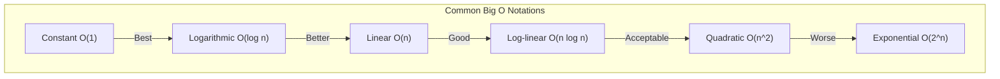

# Big O Notation

## What is Big O Notation?

Big O notation is a way of describing the performance of an algorithm. It's a way of describing how the runtime scales as the input grows. 




## Why is Big O Notation important?

Big O notation is important because it allows us to compare different algorithms on an even playing field. It's a way of measuring how efficient an algorithm is.

## How do you calculate Big O Notation?

Big O notation is calculated by looking at the number of operations an algorithm performs. It's a way of describing how the runtime scales as the input grows.

## What are the different types of Big O Notation?

There are many different types of Big O notation. The most common are:

- **O(1) :** - Constant Time (e.g. accessing an array element) - The runtime is constant, regardless of the input size.
- **O(log n) :** - Logarithmic Time (e.g. binary search) - The runtime grows logarithmically in proportion to the input size.
- **O(n) :** - Linear Time (e.g. linear search) - The runtime grows linearly in proportion to the input size.
- **O(n log n) :** - Linearithmic Time (e.g. merge sort) - The runtime grows in proportion to the input size multiplied by the logarithm of the input size.
- **O(n^2) :** - Quadratic Time (e.g. bubble sort) - The runtime grows in proportion to the square of the input size.
- **O(2^n) :** - Exponential Time (e.g. recursive Fibonacci) - The runtime grows exponentially in proportion to the input size.
- **O(n!) :** - Factorial Time (e.g. travelling salesman) - The runtime grows in proportion to the factorial of the input size.
- **O(infinity) :** - Infinite Time (e.g. never-ending loop) - The runtime never ends.
- **O(n^n) :** - Infinite Time (e.g. nested loops) - The runtime grows in proportion to the input size raised to the power of the input size.
- **O(n^n^n) :** - Infinite Time (e.g. nested loops) - The runtime grows in proportion to the input size raised to the power of the input size raised to the power of the input size.
- **O(n^n^n^n) :** - Infinite Time (e.g. nested loops) - The runtime grows in proportion to the input size raised to the power of the input size raised to the power of the input size raised to the power of the input size.
- **O(n^n^n^n^n) :** - Infinite Time (e.g. nested loops) - The runtime grows in proportion to the input size raised to the power of the input size raised to the power of the input size raised to the power of the input size raised to the power of the input size.
- **O(n^n^n.....) :** - Infinite Time (e.g. nested loops) - The runtime grows in proportion to the input size raised to the power of the input size.

## What is the difference between O(1) and O(n)?

| O(1) | O(n) |
| --- | --- |
| Constant Time | Linear Time |
| The runtime is constant, regardless of the input size. | The runtime grows linearly in proportion to the input size. |
| The runtime is the same for 1 element as it is for 1 million elements. | The runtime for 1 million elements is 1 million times longer than the runtime for 1 element. |
|for example: accessing an array element | for example: linear search |

## What is the difference between O(n) and O(n^2)?

| O(n) | O(n^2) |
| --- | --- |
| Linear Time | Quadratic Time |
| The runtime grows linearly in proportion to the input size. | The runtime grows in proportion to the square of the input size. |
| The runtime for 1 million elements is 1 million times longer than the runtime for 1 element. | The runtime for 1 million elements is 1 trillion times longer than the runtime for 1 element. |
| for example: linear search | for example: bubble sort |

## What is the difference between O(n^2) and O(2^n)?

| O(n^2) | O(2^n) |
| --- | --- |
| Quadratic Time | Exponential Time |
| The runtime grows in proportion to the square of the input size. | The runtime grows exponentially in proportion to the input size. |
| The runtime for 1 million elements is 1 trillion times longer than the runtime for 1 element. | The runtime for 1 million elements is 2^1,000,000 times longer than the runtime for 1 element. |
| for example: bubble sort | for example: recursive Fibonacci |

## What is the difference between O(2^n) and O(n^n)?

| O(2^n) | O(n^n) |
| --- | --- |
| Exponential Time | Infinite Time |
| The runtime grows exponentially in proportion to the input size. | The runtime grows in proportion to the input size raised to the power of the input size. |
| The runtime for 1 million elements is 2^1,000,000 times longer than the runtime for 1 element. | The runtime for 1 million elements is 1 million^1,000,000 times longer than the runtime for 1 element. |
| for example: recursive Fibonacci | for example: nested loops |

## Examples of Big O Notation with the help of code

### O(1) - Constant Time

```js
function constantTime(n) {
  return n * 2;
}
```

### O(log n) - Logarithmic Time

```js
function logarithmicTime(n) {
  for (let i = 1; i < n; i = i * 2) {
    console.log(i);
  }
}
```

### O(n) - Linear Time

```js
function linearTime(n) {
  for (let i = 0; i < n; i++) {
    console.log(i);
  }
}
```

### O(n log n) - Linearithmic Time

```js
function linearithmicTime(n) {
  for (let i = 0; i < n; i++) {
    for (let j = 1; j < n; j = j * 2) {
      console.log(i, j);
    }
  }
}
```

### O(n^2) - Quadratic Time

```js
function quadraticTime(n) {
  for (let i = 0; i < n; i++) {
    for (let j = 1; j < n; j++) {
      console.log(i, j);
    }
  }
}
```

### O(2^n) - Exponential Time

```js
function exponentialTime(n) {
  if (n <= 1) {
    return n;
  }
  return exponentialTime(n - 1) + exponentialTime(n - 2);
}
```

### O(n!) - Factorial Time

```js
function factorialTime(n) {
  if (n <= 1) {
    return n;
  }
  return n * factorialTime(n - 1);
}
```

### O(infinity) - Infinite Time

```js
function infiniteTime(n) {
  while (true) {
    console.log(n);
  }
}
```

### O(n^n) - Infinite Time

```js
function infiniteTime(n) {
  for (let i = 0; i < n; i++) {
    infiniteTime(n);
  }
}
```

### O(n^n^n) - Infinite Time

```js
function infiniteTime(n) {
  for (let i = 0; i < n; i++) {
    infiniteTime(n);
  }
}
```

### O(n^n^n^n) - Infinite Time

```js
function infiniteTime(n) {
  for (let i = 0; i < n; i++) {
    infiniteTime(n);
  }
}
```

### O(n^n^n^n^n) - Infinite Time

```js
function infiniteTime(n) {
  for (let i = 0; i < n; i++) {
    infiniteTime(n);
  }
}
```

### O(n^n^n.....) - Infinite Time

```js
function infiniteTime(n) {
  for (let i = 0; i < n; i++) {
    infiniteTime(n);
  }
}
```

## What is the difference between Big O Notation and Big Theta Notation?

Big O notation is a way of describing the performance of an algorithm. It's a way of describing how the runtime scales as the input grows. Big Theta notation is a way of describing the performance of an algorithm. It's a way of describing how the runtime scales as the input grows.

## What is the difference between Big O Notation and Big Omega Notation?

Big O notation is a way of describing the performance of an algorithm. It's a way of describing how the runtime scales as the input grows. Big Omega notation is a way of describing the performance of an algorithm. It's a way of describing how the runtime scales as the input grows.

## What is the difference between Big Theta Notation and Big Omega Notation?

Big Theta notation is a way of describing the performance of an algorithm. It's a way of describing how the runtime scales as the input grows. Big Omega notation is a way of describing the performance of an algorithm. It's a way of describing how the runtime scales as the input grows.

